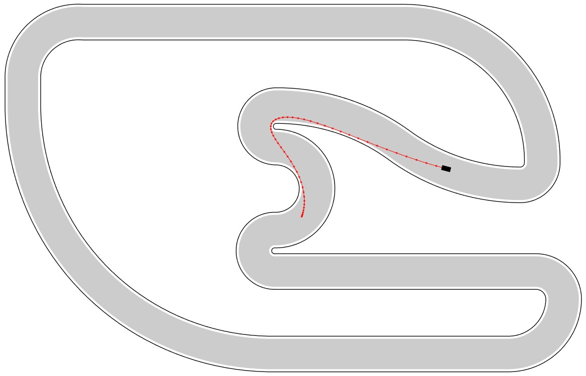

# Real-time Trajectory Optimization for Autonomous Vehicle Racing 

This project demonstrates an algorithm that can determine a near-optimal racing trajectory in ca. 50ms.
It is explained in [my bachelor's thesis](https://publications.rwth-aachen.de/record/710049/files/main.pdf) ([Mirror](https://janismac.github.io/Portfolio/projects/assets/Real-time_Trajectory_Optimization_for_Autonomous_Vehicle_Racing.pdf)).

## Demo Video

## Prerequisites

To run this code you need:

* MATLAB (Tested with version R2017a)
* IBM ILOG CPLEX Optimization Studio (Tested with version 12.6.3)

Without CPLEX, the MATLAB function `quadprog` is used as a fallback. CPLEX is free for academics, search for "IBM Academic Initiative".

## License

This project is licensed under the MIT License, see the [LICENSE](LICENSE) file for details.
